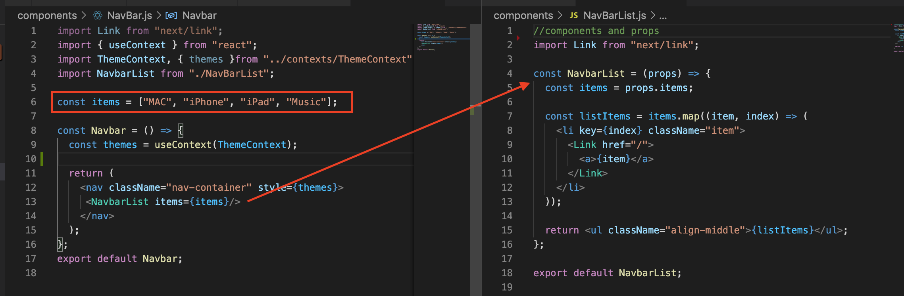
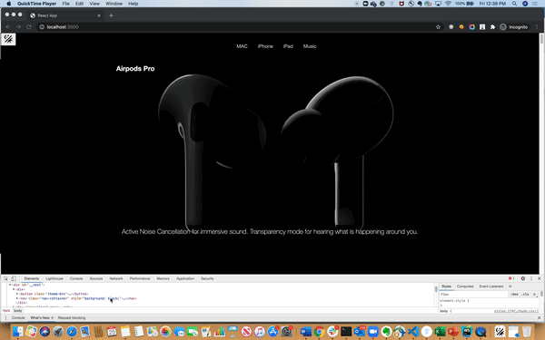

# Milestone 2 - React Framework and Nextjs
Airpods pro site with React and Nextjs

Concepts used for the Product Page documented on https://my.wal-mart.com/:x:/r/personal/j0p016n_homeoffice_wal-mart_com/_layouts/15/guestaccess.aspx?e=l9Ppfe&share=Eb1dkV51wodPqYmXGtGznnABEfR6DCkGZsmwFlYss3SXUA

## Progress for each Milestone
Jira https://jira.walmart.com/browse/CEPLASSE-3430

## Implementation of Objectives

1. **Componenets and Props**  
   
   For Milestone 2, the page has been broken  down into smaller componenets. 
   Folder structure used is as follows:

   ```
    -- components
      - Footer
      - Index
      - Layout
      - MainImage
      - NavBar
      - NavBarList
      - StickyNav

    -- contexts
      - ThemeContext

    -- pages
       - _app
       - index.js
    
    -- redux
     - actions
     - reducers
     - store

    -- index.css

   ```

   To display the items in Header, the li items array is passed to NavBarList component as props. 

    


2. **State and lifecycle events**
   
   Implemeneted lifecyle events with componentDidMount() and componentWillUnmount() for scroll event listener and display the default image on DOM render.
  
  
3. **Higher-order components and component composition**

   Higher order component is a use case of composition and is a function that takes a component and returns a new component.
   In this application, used Redux **connect** which is used to connect **MainImage component** with Redux Store. Connext returns a **higher order component** that we use to wrap Main Image component.


4. **Redux**
   
   Used redux to store the information for each section of images and text. 
   Then for each scroll to retrieve section information from store and display the image.

   Used updateSectionInfo to dispatch an action to store and update  the state.

   ```
         componentDidMount = () => {
         window.addEventListener("scroll", this.handleScroll);
         this.imageRef.current.src = "img/01-hero-lightpass/0000.jpg";
         this.props.updateSectionInfo({
            sections: [
            {
               name: "01-hero-lightpass",
               style: "white",
               text:
                  "Active Noise Cancellation for immersive sound. Transparency mode for hearing what is happening around you.",
            },
            { name: "02-head-bob-turn", text: "Arrival of the fittest." },
            { name: "03-flip-for-guts", text: "Sound that cuts out the noise." },
            {
               name: "04-explode-tips",
               text:
                  "Choose from three sizes of soft, flexible silicone tips that click into place. Find the best fit and get the best sound by using the Ear Tip Fit Test.",
            },
            {
               name: "05-flip-for-nc",
               style: "white",
               text:
                  "Enjoy superior sound quality with Adaptive EQ, which automatically tunes music to the shape of your ear for a rich, consistent listening experience.",
            },
            { name: "06-transparency-head" },
            { name: "07-flip-reveal-guts", style: "white" },
            { name: "08-turn-for-chip" },
            { name: "09-scoop-turn", style: "black" },
            {
               name: "10-fall-into-case",
               style: "white",
               text: "Charge wirelessly. Use tirelessly.",
            },
            ],
         });
      };

    ```

   **To dispatch action to update store state. Data is the payload which has the sections info object.**
    ```
            const mapDispatchToProps = (dispatch) => ({
               updateSectionInfo: (data) => dispatch(sectionInfo(data)),
            });

    ```

5. **Hooks**

   In Layout functional component implemented hooks with **useState** to update the theme on button click.

   ```
     const [theme, setTheme] = useState(themes.light); //useState hook - add react state to function component
     const toggleTheme = () => {
           theme === themes.dark ? setTheme(themes.light) : setTheme(themes.dark);
        };

     return (
      <ThemeContext.Provider value={theme}>
        <button className="theme-btn" onClick={toggleTheme}>
        CHANGE THEME
        </button>
        <Navbar />
      </ThemeContext.Provider>

   ```
    

6. **Context**

   Used to update the theme of the header nav with Button click

   ``` 
     context -> ThemeContext
   ```
   The React.createContext() function is used to create the context and is available to use anywhere in app.
   Then we will use ThemeContext.Provider to enclose the component we would like to share the context with.


7. **NodeJS**


8. **NextJS**
   


**How to run the app**
 ```
  git clone https://github.com/monikaphogat4/milestone2.git

  npm i
  npm run build
  npm run start

  or
  npm i
  npm run dev **dev mode**

  ```
